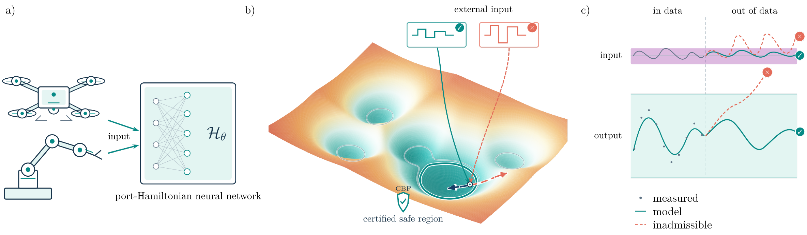
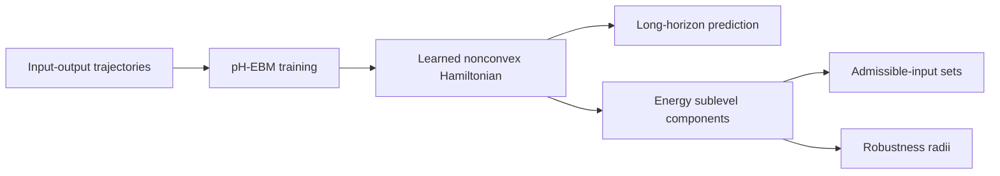

<div align="center">

# Safe-by-design Learning via Energy-Based Neural Networks

### Expressive neural dynamics with invariant-set certificates built into the learned energy

[](requirements.txt)
[](requirements.txt)
[](#paper)
[](#reproducibility)

**Simone Betteti · Morteza Lahijanian · Luca Laurenti**

[Why pH-EBM?](#why-ph-ebm) · [Quick start](#quick-start) · [Benchmarks](#benchmarks) · [Certificates](#safety-certificates) · [Repository map](#repository-map) · [Citation](#citation)

</div>



> **One learned Hamiltonian, two roles.** It shapes the neural dynamics and
> simultaneously defines compact energy regions whose admissible inputs can be
> certified from the port-Hamiltonian energy balance.

This repository is the complete implementation and artifact bundle accompanying
the ICLR 2027 submission **“Safe-by-design Learning via Energy-Based Neural
Networks.”** It includes the pH-EBM model, six benchmark interfaces, frozen
champions, adversarial PortHNN-u comparisons, theory-aligned stress tests, and
the runtime HNER99 normalized-robustness workflow.

## Why pH-EBM?

Accurate short-horizon prediction does not ensure safe recursive deployment.
An unconstrained neural model can fit observed trajectories and still drift,
inject energy, or leave the operating region under new inputs. pH-EBM makes
certifiability an architectural property of the learned dynamics:

```math
\dot z = \big[J_\theta(z)-R_\theta(z)\big]\nabla \mathcal H_\theta(z)
       +G_\theta(z)u,
```

where (J_	heta=-J_	heta^\top) preserves energy,
(R_	heta\succeq0) dissipates energy, (G_	heta) exposes the input port,
and (mathcal H_	heta) is a coercive yet globally nonconvex modern-Hopfield
Hamiltonian.



The design separates two normally conflicting requirements:

- **Expressivity inside the operating region:** a modern Hopfield energy can
  represent multiple wells, attractors, and nonlinear geometry.
- **Confinement at large state norm:** coercivity makes bounded-energy sublevel
  sets compact without forcing the Hamiltonian to be globally convex.
- **Certificates from the learned model itself:** dissipation and input
  exposure determine which inputs keep the vector field inward-pointing on an
  energy boundary.

<details>
<summary><strong>How the boundary certificate is obtained</strong></summary>

For an isolated learned-energy minimum (z_\star), define the connected
sublevel component

```math
\mathcal C_{\epsilon,\star}
=\operatorname{Comp}_{z_\star}
\left\{z:\mathcal H_\theta(z)-\mathcal H_\theta(z_\star)\le\epsilon\right\}.
```

On its boundary, the energy balance separates dissipation and input power:

```math
d_H(z)=\nabla\mathcal H_\theta(z)^\top R_\theta(z)
\nabla\mathcal H_\theta(z),\qquad
a_H(z)=G_\theta(z)^\top\nabla\mathcal H_\theta(z).
```

The pointwise admissible-input radius and the uniform component radius are

```math
\rho_{\mathrm{BF}}(z)=\frac{d_H(z)}{\lVert a_H(z)\rVert_*},
\qquad
\rho_{\epsilon,\star}=\inf_{z\in\partial\mathcal C_{\epsilon,\star}}
\rho_{\mathrm{BF}}(z).
```

Thus, every input satisfying
(\lVert u\rVert\le\rho_{\epsilon,\star}) keeps the learned vector field
inward-pointing or tangent on the complete boundary. The repository also
contains bounded-disturbance extensions, regular-boundary estimates, and
empirical normalized radii for cross-model comparison.

</details>

## What is included

| Capability | Included implementation |
| --- | --- |
| Structured neural ODE | Free skew-symmetric (J), learned PSD (R), learned (G), modern-Hopfield (mathcal H) |
| System identification | State-observed and output-only interfaces, learned encoders/readouts, RK4 rollout training |
| Safety analysis | Energy wells, full-state shell tracing, barrier margins, input-radius sweeps |
| Visualization | Exact affine slices, profiled projections, 2D/3D energy geometry, certificate figures |
| Adversarial comparison | Frozen PortHNN-u champions for Duffing, three-link, Silverbox, and CED |
| Normalized robustness | Runtime HNER99 library, artifact registry, fixed-budget audit, frozen reports |
| Reproducibility | Dataset assets, configurations, checkpoints, predictions, metrics, and aggregate validators |

## Quick start

Python 3.11 is recommended.

```bash
# After cloning or downloading the repository:
cd EBM_ICLR2027

python -m venv .venv
source .venv/bin/activate
python -m pip install --upgrade pip
python -m pip install -r requirements.txt
```

The NanoDrone black-box comparator additionally requires a PyTorch3D build
matching the local PyTorch/CUDA environment. Follow the
[PyTorch3D installation guide](https://github.com/facebookresearch/pytorch3d/blob/main/INSTALL.md),
then install the optional requirements:

```bash
python -m pip install -r requirements-optional.txt
```

### 1. Validate the release

Run the dependency-light structural and artifact checks first:

```bash
python validate_release.py --structural
```

Then execute end-to-end champion inference and the PortHNN-u runtime checks:

```bash
python validate_release.py
python scripts/validate_porthnn_u_runtime.py
```

All validators return a nonzero exit code on failure; requested models are not
silently skipped.

### 2. Inspect a frozen pH-EBM champion

```bash
python dataset_interfaces/run_champion.py duffing_doublewell --dry-run
python dataset_interfaces/run_champion.py CED --dry-run
python dataset_interfaces/run_champion.py nanodrone_S3 --dry-run
```

Available selectors are `duffing_doublewell`,
`deep_dissipative_nlink_n2`, `deep_dissipative_nlink_n3`, `nanodrone_S3`,
`CED`, and `Silverbox`.

### 3. Explore the adversarial PortHNN-u comparison

```bash
python -m porthnn_u.cli --help
python scripts/validate_porthnn_u_artifacts.py
python baselines/porthnn_u/scripts/evaluate_three_link.py --help
```

### 4. Recompute normalized robustness radii

```bash
python scripts/validate_hner99_artifacts.py
python -m runtime_hner99 --list
python scripts/compute_robustness_radii.py duffing_phebm duffing_porthnn
python scripts/audit_hner99_runtime.py ced_phebm ced_porthnn
```

Fresh HNER99 results are written to `results/hner99_runtime/`; supplied frozen
reports under `certificates/hner99/` are never overwritten.

## Benchmarks

The suite moves from classical nonlinear identification to nonconvex mechanics
and high-dimensional flight dynamics.

| Benchmark | Latent state | Hamiltonian | Inputs | Repository support |
| --- | ---: | --- | ---: | --- |
| Silverbox | 4 | (128\rightarrow64), softmax (
ightarrow) polynomial | 1 | pH-EBM interface + PortHNN-u champion |
| CED | 4 | (96\rightarrow48), softmax (
ightarrow) polynomial | 1 | pH-EBM champion + PortHNN-u champion |
| Duffing double well | 2 | (64\rightarrow32), tanh (
ightarrow) polynomial | 1 | pH-EBM + PortHNN-u + nonconvex certificate figures |
| 2/3-link pendulum | 8 for reported 3-link pH-EBM | (64\rightarrow32), tanh (
ightarrow) polynomial | 1 | pH-EBM + DDM + full-(J/R/G) PortHNN-u |
| NanoDrone S3 | 12 | (128\rightarrow64), tanh (
ightarrow) polynomial | 4 | pH-EBM + black-box reference + long-horizon tests |

<details>
<summary><strong>Headline experimental results from the submitted paper</strong></summary>

| Benchmark | Reference RMSE | PortHNN-u RMSE / radius | pH-EBM RMSE / radius |
| --- | ---: | ---: | ---: |
| Silverbox | **0.293** | 47.821 / (2\times10^{-2}) | 0.422 / **(2\times10^{-1})** |
| CED | **0.054** | 0.217 / (3\times10^{-2}) | 0.064 / **(6\times10^{-1})** |
| Duffing double well | — | 0.254 / (5\times10^{-4}) | **0.048 / (4\times10^{-1})** |
| 3-link pendulum | 0.051 | 0.276 / (5\times10^{-3}) | **0.014 / (2\times10^{-1})** |
| NanoDrone, 0.5 s | 13.712 | — | **12.521 / (6\times10^{-2})** |
| NanoDrone, 5 s | 1363.701 | — | **369.025 / (6\times10^{-2})** |

RMSE uses each benchmark's native units and evaluation protocol. Radii are the
paper's reported robustness values; absence of a baseline certificate is shown
as unavailable, not zero.

</details>

### NanoDrone: prediction beyond the training horizon

The NanoDrone model is trained from disjoint 0.5 s segments and evaluated over
5 s recursive rollouts. The included experiments distinguish local fit from
deployment behavior: under both training-supported S3 excitation and held-out
Melon inputs, the pH-EBM remains bounded by its learned energy geometry while
the unconstrained black-box model can drift outside the displayed operating
region.

## Safety certificates

The repository exposes three complementary levels of analysis:

1. **Exact model-level definitions** — admissible-input sets and invariant
   energy components derived from the continuous learned dynamics.
2. **Theory-aligned numerical estimates** — sampled full-state shells,
   pointwise boundary radii, regular-boundary estimates, and epsilon sweeps.
3. **HNER99 comparisons** — a common 99% validation-occupancy shell and input
   second-moment normalization for empirical cross-model benchmarking.

> [!IMPORTANT]
> The exact invariance statements concern the **learned model dynamics**.
> Transferring them to the physical plant requires a validated model-mismatch
> or disturbance enclosure. HNER99 is an empirical finite-shell comparison
> metric and is not a formal global certificate.

<details>
<summary><strong>How high-dimensional Hamiltonians are visualized</strong></summary>

The plotting suite labels two reductions separately:

- **Affine slice:**
  (H_{\mathrm{slice}}(\zeta)=\mathcal H(c+U\zeta)), with all unshown
  coordinates fixed.
- **Profiled envelope:**
  (\widetilde H(\zeta)=\min_\omega\mathcal H(c+U\zeta+V\omega)), which
  approximates the planar projection of the full sublevel set.

With multiple wells, the first display direction follows inter-well geometry
and the second captures dominant orthogonal boundary variation. With one well,
the default is boundary PCA. Duffing is already two-dimensional and requires no
projection.

</details>

## Repository map

```text
EBM_model/              Core pH-EBM energy, J/R/G fields, rollout, and training
dataset_interfaces/     Benchmark adapters and champion entry points
datasets/               Data, configurations, checkpoints, and curated figures
Stress_test_final/      Stress tests, shell geometry, certificates, and plotting
porthnn_u/              Unified PortHNN-u implementation
baselines/porthnn_u/    Frozen comparison champions and experiment launchers
runtime_hner99/         Normalized-radius library, audits, and artifact access
certificates/hner99/    Frozen HNER99 reports and checkpoint provenance
scripts/                Aggregate validation and reviewer-facing commands
assets/                 GitHub presentation assets
```

For detailed provenance, see [FILE_MAP.md](FILE_MAP.md),
[MERGE_REPORT.md](MERGE_REPORT.md), and
[VALIDATION_REPORT.md](VALIDATION_REPORT.md).

## Reproducibility

- Frozen champion configurations and checkpoints are colocated with their
  benchmark assets.
- Stored predictions and metrics are checked independently of JAX execution.
- Package paths are derived from repository locations; no cluster-specific
  filesystem is required.
- Fresh computations write outside the frozen champion and certificate trees.
- HNER99 records known provenance limitations explicitly: the historical
  Silverbox pH-EBM checkpoint was not supplied, and the historical NanoDrone
  report used seed 23 while the included champion uses seed 47.

The optional deep-dissipative reference can be installed separately:

```bash
python -m pip install ./dataset_interfaces/baseline_interfaces/deep_dissipative_model
```

## Paper

**Safe-by-design Learning via Energy-Based Neural Networks**  
Simone Betteti, Morteza Lahijanian, and Luca Laurenti.  
Submitted to the International Conference on Learning Representations (ICLR
2027).

The vector source of the graphical abstract is available as
[PDF](assets/graphical_abstract.pdf).

## Citation

If this repository contributes to your research, please cite the accompanying
paper. A machine-readable entry is provided in [CITATION.cff](CITATION.cff).

```bibtex
@inproceedings{betteti2027safebydesign,
  title     = {Safe-by-design Learning via Energy-Based Neural Networks},
  author    = {Betteti, Simone and Lahijanian, Morteza and Laurenti, Luca},
  booktitle = {International Conference on Learning Representations},
  year      = {2027}
}
```

## Acknowledging implementation ownership

The proprietary model implementation under `EBM_model/`, the stress-test suite
under `Stress_test_final/`, and the runtime HNER99 implementation under
`runtime_hner99/` carry source-level attribution to **Simone Betteti** and the
paper **“Safe-by-design learning via energy-based neural network.”**
